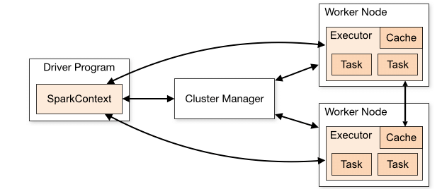
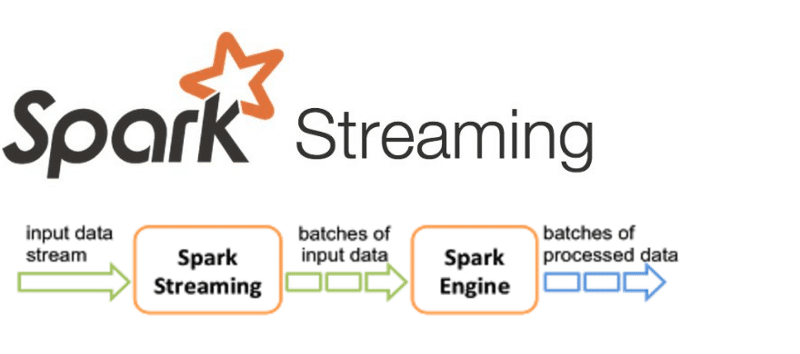
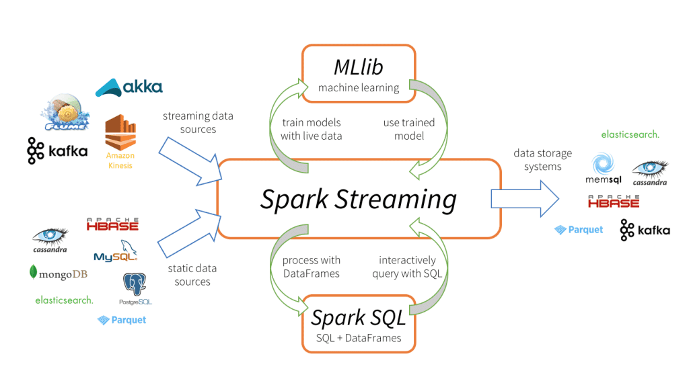
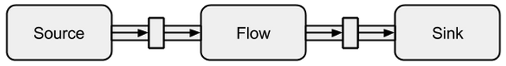

# Table of contents

1. [Introduction](#intro)
2. [About Spark](#spark)
    1. [How Spark works](#how)
    2. [Spark Streaming](#ss)
    3. [Spark Streaming on K8s](#k8s)
2. [Spark Streaming vs Akka Streams](#vs)
3. [Practical example](#example)
    1. [Prerequisites](#setup)
    2. [App preparation](#app-dev)
    3. [Deployment to K8s](#deployment)
    4. [Results](#results)

# Introduction <a name="intro"></a>

# About Spark <a name="spark"></a>
## How Spark works <a name="how"></a>


## Spark Streaming <a name="ss"></a>


## Spark Streaming on K8s <a name="k8s"></a>


More details: https://spark.apache.org/docs/latest/running-on-kubernetes.html

### Benefits of Spark on k8s

- Supported by Spark 2.3+ and Kubernetes 1.6+.
- Marginally better performance (5% according to Amazon).
- Option to package all dependencies along with Spark applications in containers. This avoids dependency issues that are common with Spark.
- Better resource management.
- Swappable backend infrastructure means Spark applications are now portable across hybrid cloud setups.
- Kubernetes Role and ClusterRole features allow you to set fine-grained permissions for resources and organize these permissions based on API groups. 
- Tag container images for version control which facilitates better auditing, and ability to rollback failed deployments.
- Better integration with DevOps ecosystem like ArgoCD, Grafana.

# Spark Streaming vs Akka Streams <a name="vs"></a>

### Spark Streaming



#### Pros :

- Built with Big Data in mind from day 1.
- Fault tolerance, flexible APIs, multiple formats and connectors to choose from.
- Integrates very well with Kafka, Machine Learning.
- Supports SQL as DSL, which makes it easier to use by Analysts.
- Supported in Python, Java and Scala.
- Can be scaled very easily both horizontally and vertically.
- Ugly but very functional monitoring UI and history server.
- Lineage for more complex processing, i.e. https://absaoss.github.io/spline/
#### Cons :

- Having the flexibility makes it very heavy when it comes to container size as well as start up time.
- Real time latency is not possible.
- There is no type safety built in at compile time, sometimes it can be hard to debug.
- It is mature but has many annoying bugs.
- Performance can be pretty bad if the features are misused or not understood well.
- Needs a dedicated cluster with resource management to run.
### Akka Streams


#### Pros : 

- Akka streams implement something called reactive manifesto which is great to achieve really low latency.
- Akka streams provide a lot of operators to write declaratively transformations over streams easily.
- One of the best approach to use when working with a real-time or reactive category.
- Allows for more customization and optimization for specific use cases.
- Akka streams are quite economical in when it comes to threads.

#### Cons:

- It requires learning the DSL and also understanding what’s going on under the hood to some extent.
- Implementation is sometimes hard to read and can be conceptually complicated. It requires special way of thinking.
- Akka Streams are not “deployed” nor automatically distributed.
- It is a bit harder to scale horizontally adn vertically.
- Falls off when heavy processing or high volume processing is required.

### Comparison table

|                | **Spark**      | **Akka**    |
|----------------|----------------|-------------|
| Latency        | Near Real Time | Real Time   |
| Architecture   | Micro Batch    | Flow        |
| Stage type     | Query          | Graph       |
| Container size | Big            | Small       |
| Startup time   | Long           | Short       |
| Use case       | Aggregations   | Projections |

# Practical example <a name="example"></a>

## Prerequisites <a name="setup"></a>

- minikube (and optionally kafkacat) `brew install minikube kafkacat`
- docker (I had to use docker desktop with my m1 setup) `brew install docker` (or using this link for m1 mac: https://docs.docker.com/desktop/mac/apple-silicon/)

### Starting minikube

```bash
minikube stop
minikube delete
minikube start --insecure-registry="localhost:5000" --memory 7851 --cpus 4
minikube addons enable registry
```

### Geting minikube ip and master address

```bash
minikube ip
minikube ssh -- nslookup host.minikube.internal
kubectl cluster-info
```
### Running minikube dashboard

```bash
minikube dashboard --url &
kubectl proxy --address='0.0.0.0' --disable-filter=true --port=5885 &
```

## App Development <a name="app-dev"></a>

### Build Kafka

```bash
docker-compose up --build -d zookeeper kafka
docker-compose logs -f
```

### Build Postgres

```bash
docker-compose up --build -d postgres
```

### Bulding Spark docker image

#### Download jar files

```bash
sh jarfile_download.sh
```
#### Build the image

```bash
docker-compose up --build -d spark
```
### Push Location Dataset to Kafka

```bash
docker-compose exec spark python produce_data.py
```
### Check the Kafka Topic

```bash
kcat -b localhost:9092 -o beginning -t locations -C -c2 | jq
```

### Run spark streaming locally

```bash
docker-compose exec spark \
spark-submit --verbose --packages org.apache.spark:spark-sql-kafka-0-10_2.12:3.1.1 \
--master local --jars /opt/spark/jars/postgresql-42.2.5.jar \
stream_process.py postgres kafka:29092
```

### Check the result

```
docker-compose exec postgres psql -h localhost -U admin appdb;

select * from locations limit 10;
select count(*) from locations limit 10;
```

## App K8s Deployment <a name="deployment"></a>

```bash
cd k8s/
```

### Spark Image in Registry

#### start registry proxy

```bash
docker run -d --rm -it --network=host alpine ash -c "apk add socat && socat TCP-LISTEN:5000,reuseaddr,fork TCP:192.168.49.2:5000"
```
#### tag and push image to registry

```bash
docker tag spark-streaming-k8s_spark localhost:5000/stream-spark:v4
docker push localhost:5000/stream-spark:v4
```
### Run Spark Streaming

#### Download Spark

```bash
wget https://archive.apache.org/dist/spark/spark-3.1.1/spark-3.1.1-bin-hadoop3.2.tgz && \
tar -xzvf spark-3.1.1-bin-hadoop3.2.tgz && \
rm -rf spark-3.1.1-bin-hadoop3.2.tgz
```
#### Create Spark Service Account

```bash
kubectl create serviceaccount spark
kubectl create clusterrolebinding spark-role --clusterrole=edit  --serviceaccount=default:spark --namespace=default
kubectl cluster-info
kubectl proxy --address='0.0.0.0' --disable-filter=true --port=8443 &

```

#### Spark Submit Streaming

```bash
kubectl apply -f k8s-config.yaml
```

```
./spark-3.1.1-bin-hadoop3.2/bin/spark-submit --verbose --master k8s://http://localhost:8443 \
--deploy-mode cluster \
--conf spark.kubernetes.driver.pod.name=location-streaming-app \
--conf spark.kubernetes.container.image.pullPolicy=Always \
--conf spark.executor.instances=1 \
--conf spark.executor.memory=2G \
--conf spark.executor.cores=1 \
--conf spark.driver.memory=1G \
--conf spark.kubernetes.authenticate.driver.serviceAccountName=spark \
--conf spark.kubernetes.container.image=localhost:5000/stream-spark:v4 \
--name locations-streaming \
--jars local:///opt/spark/jars/commons-pool2-2.9.0.jar,local:///opt/spark/jars/postgresql-42.2.5.jar,local:///opt/spark/jars/spark-streaming_2.12-3.1.1.jar,local:///opt/spark/jars/spark-token-provider-kafka-0-10_2.12-3.1.1.jar,local:///opt/spark/jars/kafka-clients-2.6.0.jar,local:///opt/spark/jars/spark-sql-kafka-0-10_2.12-3.1.1.jar,local:///opt/spark/jars/spark-streaming-kafka-0-10-assembly_2.12-3.1.1.jar local:///opt/work-dir/stream_process.py postgres kafka:9093
```

## Results <a name="results"></a>

### Logs

```bash
kubectl logs -f pod/location-streaming-app
```

### Spark UI
```bash
kubectl port-forward --address 0.0.0.0 pod/location-streaming-app 4040:4040 &
http://localhost:4040/
```

### Postgres

```bash
docker-compose exec postgres psql -h localhost -U admin appdb;

select * from locations limit 10;
select count(*) from locations limit 10;
```
